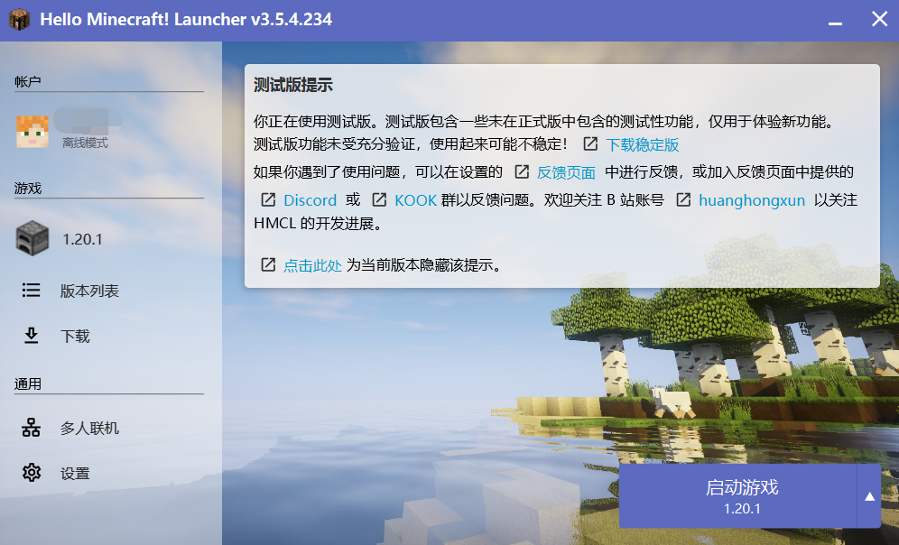
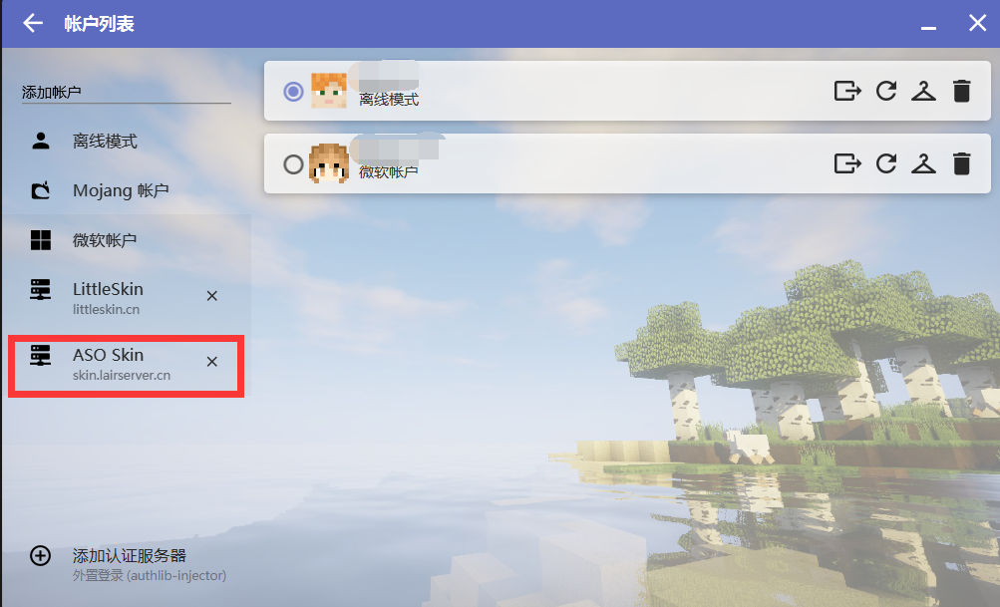
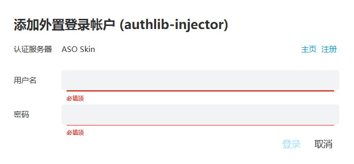
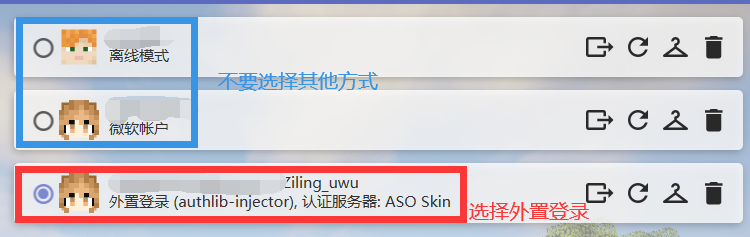
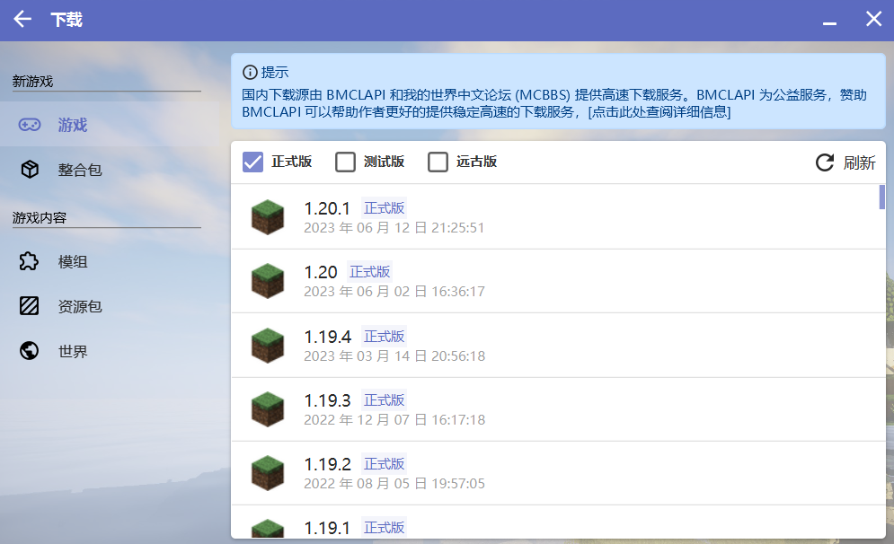
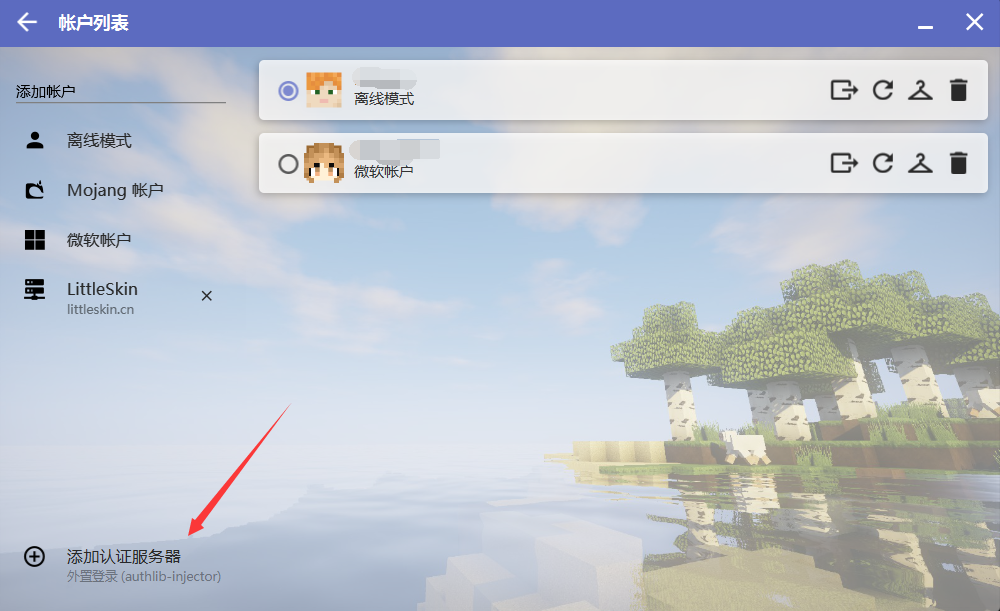

## 下载客户端

### 从群文件下载

从群文件列表中，下载`HMCL Lair.zip`

#### Step1 解压

解压`HMCL Lair.zip`，到您喜欢的位置，然后打开`HMCL-3.5.4.234.exe`

#### Step2 配置

打开后，您的主界面大概如下：

点击左上角的账户，在侧边栏点击`ASO Skin`

在弹出来的提示框中，输入自己在皮肤站注册的**邮箱**和密码，点击`登录`

::: warning 请确认

右侧的账户选择是外置登录

:::

退出到主界面，开始游戏

### 自行配置

#### Step1 下载游戏

在此界面下载`1.20.1`版本

#### Step2 配置认证服务器

点击左上角的账户，在侧边栏点击`添加认证服务器`

在弹出的提示框中输入`http://skin.lairserver.cn/api/yggdrasil`，点击`下一步`和`完成`

#### Step3 开始游戏

在侧边栏点击`ASO Skin`

在弹出来的提示框中，输入自己在皮肤站注册的**邮箱**和密码，点击`登录`

::: warning 请确认

右侧的账户选择是外置登录

:::

退出到主界面，开始游戏
