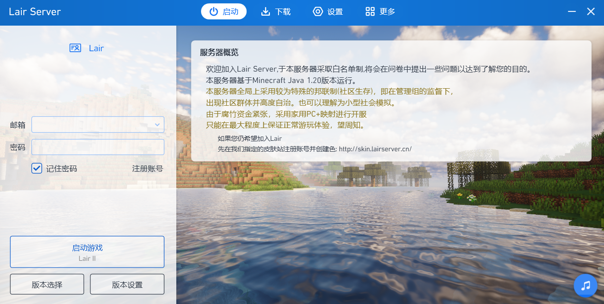
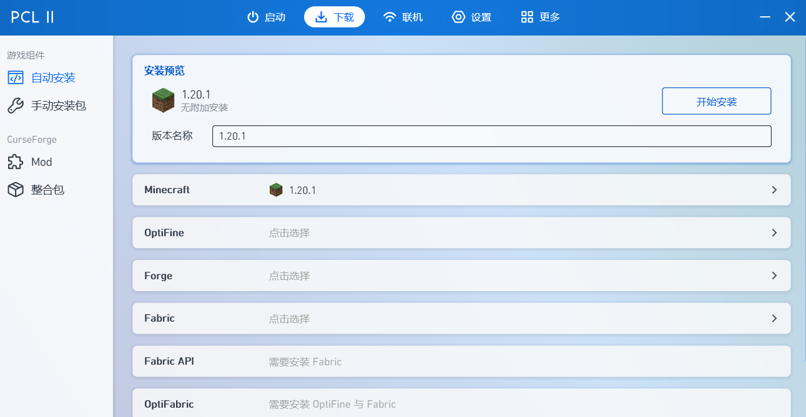
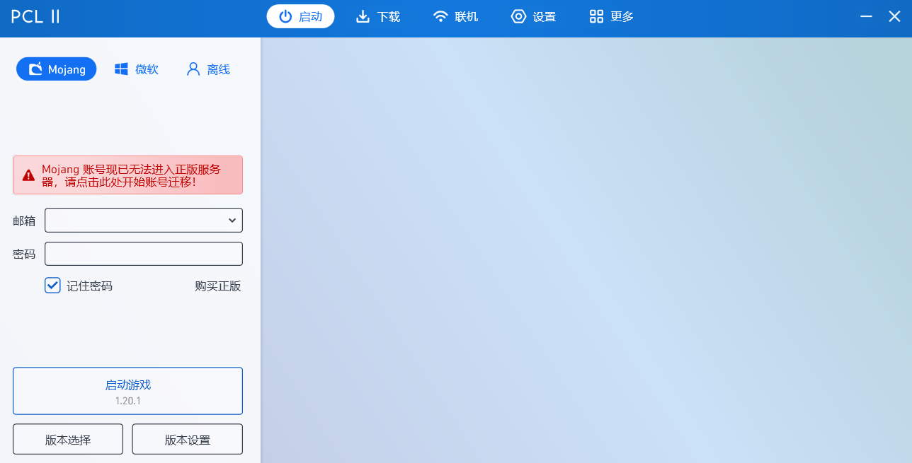
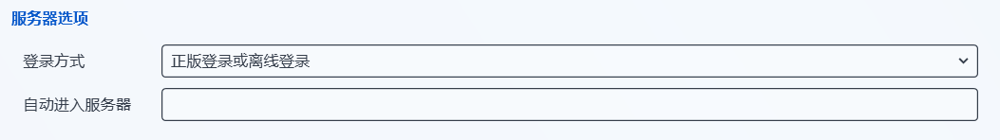
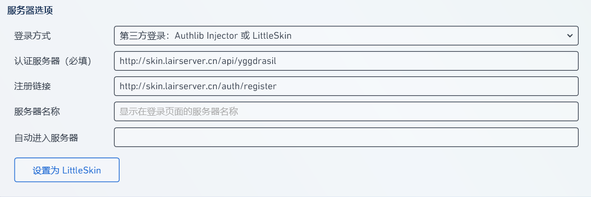

::: danger 须知

使用 PCL2 加入服务器后，可能出现无法聊天的情况

如果遇到，请移步[通过 HMCL 加入服务器](hmcl.md)

:::

## 下载客户端

### 从群文件下载

从群文件列表中，下载`Lair 1.20.1.zip`

#### Step1 解压

解压`Lair 1.20.1.zip`，到您喜欢的位置，然后打开`Start.exe`

#### Step2 开始游戏

打开后，您的主界面大概如下：

::: info

如果不想要背景音乐，可以点击右下角的音乐图标

:::

在侧边框内填入自己在皮肤站注册的**邮箱**和密码

开始游戏

### 自行配置

#### Step1 下载游戏

在此界面下载`1.20.1`版本

#### Step2 配置认证服务器

切换为`1.20.1`版本后，您的主界面大概如下：

打开左下角的`版本设置`，并在侧边栏选择`设置`

向下滚动页面，即可发现这一栏：

将其变更为：

::: danger 注意

请务必确认认证服务器不是https，而是http

http://skin.lairserver.cn/api/yggdrasil
http://skin.lairserver.cn/auth/register

:::

#### Step3 开始游戏

直接退出到主界面(通过左上角的小标)

::: warning 注意

不要误触`设置为LittleSkin`按钮

:::

在侧边框内填入自己在皮肤站注册的**邮箱**和密码

开始游戏
